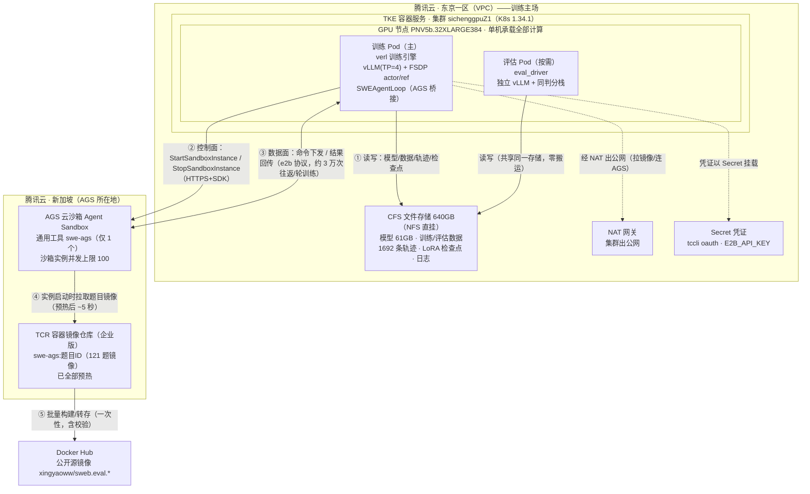

# 训练云架构图：腾讯云产品与算力全景

> **定位**：一页看清训练用到的**每一个腾讯云产品**与**每一份算力**，以及它们之间的数据/控制流。
> **双版本**：§1 为 Mermaid 图（GitHub 直接渲染，可导出 PNG 用于 PPT）；
> §2 为 ASCII 版（纯文本环境/文档粘贴）。
> **数据基准**：`swegym-30b-tier0-r1` 真实训练（4×L20，50 步，1692 轨迹）；
> 配套 [tke-gpu-cluster-usage.md](tke-gpu-cluster-usage.md)（资源账）与
> [tke-ags-tcr-pipeline-report.md](tke-ags-tcr-pipeline-report.md)（流程详解）。

---

## 1. 主架构图（Mermaid · 可渲染）



**图例说明**：
- **实线粗箭头** = 训练运行时持续发生的数据/控制流；
- **虚线** = 基础设施依赖（凭证、网络）；
- 关键约束：AGS 与 TCR 在**新加坡**，训练在**东京**——跨境 HTTPS 延迟（单次命令往返约 0.3-1 秒）由 16 路并发掩盖。

---

## 2. 主架构图（ASCII 版 · 可直接贴 PPT）

```
┌────────────────── 腾讯云 · 东京一区（VPC）—— 训练主场 ──────────────────────┐
│                                                                             │
│  ┌── TKE 容器服务 · 集群 sichenggpuZ1（K8s 1.34.1）───────────────────────┐  │
│  │                                                                        │  │
│  │   ┌─ GPU 节点 PNV5b.32XLARGE384（单机承载全部计算）─────────────────┐   │  │
│  │   │                                                                  │   │  │
│  │   │   训练 Pod（主）                        评估 Pod（按需启用）       │   │  │
│  │   │   ┌────────────────────────────┐       ┌───────────────────┐    │   │  │
│  │   │   │ verl 训练引擎               │       │ eval_driver        │    │   │  │
│  │   │   │  · vLLM（TP=4，推理）       │       │  · 独立 vLLM 进程  │    │   │  │
│  │   │   │  · FSDP actor/ref（训练）   │       │  · 同一套判分栈    │    │   │  │
│  │   │   │  · SWEAgentLoop（AGS 桥接） │       │  · 40 题 A/B 对照  │    │   │  │
│  │   │   └────────────────────────────┘       └───────────────────┘    │   │  │
│  │   │                                                                  │   │  │
│  │   │   算力：4× NVIDIA L20（48GB×4 = 192GB 显存）                      │   │  │
│  │   │         128 vCPU · 384GB 内存（Pod limit 350Gi）· shm 32Gi       │   │  │
│  │   └──────────────────────────────────────────────────────────────────┘   │  │
│  └────────────────────────────────────────────────────────────────────────┘  │
│                                                                             │
│  ┌─ CFS 文件存储（640GB，NFS 直挂）────┐  ┌─ NAT 网关 ─┐  ┌─ Secret ────┐     │
│  │  模型 61GB · 训练/评估 parquet      │  │  出公网     │  │ tccli oauth │     │
│  │  1692 条轨迹 · LoRA 检查点(51MB/个) │  │  （拉镜像、 │  │ E2B_API_KEY │     │
│  │  训练日志 + gpu.csv（30s 采样）      │  │   连 AGS）  │  │ （Secret）  │     │
│  └────────────────────────────────────┘  └────────────┘  └─────────────┘     │
└──────────────────────────────┬───────────────────────────┬──────────────────┘
                               │                           ▲
            ② 控制面：建/销沙箱  │      ④ 拉取题目镜像        │
               （HTTPS + 腾讯云 │      （预热后 ~5 秒）      │
                AGS SDK）      │                           │
            ③ 数据面：命令/回传 │                           │
               （e2b 协议）     │                           │
                               ▼                           │
┌──────────── 腾讯云 · 新加坡 ────────────┐   ┌─────────────┴────────────────┐
│  AGS 云沙箱（Agent Sandbox）            │   │  TCR 容器镜像仓库（企业版）    │
│  · 通用工具 swe-ags（仅 1 个）          │   │  · swe-ags:<题目ID>（121 题） │
│  · 沙箱实例（每题一个专属镜像）          │   │  · 已全部预热                │
│  · 并发上限 100（按批调度）             │   │  · 镜像源：DockerHub 公开镜像 │
│  · envd：命令执行 / 文件读写            │   └──────────────────────────────┘
└─────────────────────────────────────────┘                 ▲
                                                            │ ⑤ 批量构建/转存（一次性）
                                              ┌─────────────┴────────────────┐
                                              │  Docker Hub（公开源镜像）     │
                                              │  xingyaoww/sweb.eval.x86_64.* │
                                              └──────────────────────────────┘
```

---

## 3. 腾讯云产品清单（7 项，各司其职）

| # | 产品 | 在训练中的角色 | 关键规格 / 配置 | 对应流程环节 |
|---|---|---|---|---|
| 1 | **TKE 容器服务** | 调度并运行训练/评估 Pod | 集群 `sichenggpuZ1`（东京一区，K8s 1.34.1）| 训练全流程的"运行底座" |
| 2 | **GPU 云服务器** | 提供全部算力（单节点）| **PNV5b.32XLARGE384**：4×L20 / 128 vCPU / 384GB 内存 | vLLM 推理 + FSDP 训练 |
| 3 | **CFS 文件存储** | 模型/数据/轨迹/检查点/日志的共享存储 | 640GB，NFS 同 VPC 直挂（Pod 重建不丢数据）| 证据链落盘 + 断点续训 |
| 4 | **TCR 容器镜像服务** | 存放 121 道题的沙箱环境镜像 | 企业版仓库；`swe-ags:<题目ID>`；已全部预热 | 镜像供应链（④⑤） |
| 5 | **AGS 云沙箱（Agent Sandbox）** | 每条轨迹的隔离执行环境 | 通用工具 `swe-ags`（1 个）；实例并发上限 100 | 做题 + 判分（②③） |
| 6 | **VPC + NAT 网关** | 集群出公网（拉镜像、连 AGS/TCR）| 同 VPC 内 CFS 直挂；公网走 NAT | 全部跨境通信 |
| 7 | **Secret（凭证）** | oauth 凭证 + E2B API Key 注入 | `tccli` oauth（自动续期）· `E2B_API_KEY` | 控制面鉴权（②）|

> **一个刻意的"不购买"**：不使用云日志服务/监控产品——训练日志、GPU 采样（`gpu.csv`，30 秒间隔）、
> 轨迹证据全部**自采后落 CFS**，与训练数据同源、随归档包一起交付（可离线复核）。

## 4. 算力明细（实测配置）

### 4.1 GPU（4×L20 = 192GB 显存，单卡实测可用 44.99GB）

| 用途 | 占用 | 说明 |
|---|---|---|
| vLLM 权重分片（TP=4）| 15.3 GB/卡 | 61GB 模型 4 卡平分 |
| vLLM KV cache（util 0.5）| ~7 GB/卡 | 支撑 16384 上下文 |
| FSDP actor / ref | 分片后按需驻留 | `param_offload=True` 降峰值 |
| **训练峰值（实测）** | **~26 GB/卡** | 余量健康，全程无显存故障 |

### 4.2 主机内存（384GB，Pod limit 350Gi）★ 最容易踩的坑

| 构成 | 大小 |
|---|---|
| vLLM 休眠备份（训练期权重存 CPU）| ~100 GB |
| FSDP actor 参数 offload | 61 GB |
| FSDP ref 参数 offload | 61 GB |
| 共享内存 shm | 32 GB |
| Ray 对象存储 + 引擎开销 | 余量 |
| **经验公式** | **内存 ≈ 3× 模型大小；300Gi 会 OOM（实测事故）** |

### 4.3 存储（CFS 640GB）与网络

| 项 | 值 |
|---|---|
| 模型（16 分片）| 61.1 GB |
| LoRA 检查点 | 166 MB/个（每 5 步，保留 3 个）|
| 最终 adapter | 51.1 MB |
| 轨迹证据（1692 条 + 评估 320 条）| 数 GB |
| 日志 + GPU 采样 | 约 2.5 GB |
| 网络路径 | Pod（东京）→ NAT → 公网 HTTPS → AGS/TCR（新加坡）；单命令往返 0.3–1 秒 |

## 5. 流程视角：一个训练 step（781 秒）的算力分配

```
┌── GPU 4×L20 ──────────────────────────────────────────────────────┐
│                                                                    │
│  ████████████████████████████████████████████  vLLM 生成 641s（82%）│
│  （rollout：32~64 条轨迹在 AGS 沙箱中做题；                            │
│    沙箱执行累计 ~140s 与之重叠，不额外占 GPU）                         │
│                                                                    │
│  ██████  FSDP actor 更新 75s（10%）                                 │
│  ██ 概率复算 31s + 参考模型 30s（8%）                                │
│  ▌ 权重同步 3.4s（0.4%，搬 51MB）                                   │
└────────────────────────────────────────────────────────────────────┘
   ▲ AGS 沙箱（新加坡）与上面的"生成"并行工作：
     每步创建/销毁 ~70 个沙箱 + ~285 次命令往返 —— 全部被 GPU 生成时间掩盖
```

## 6. 网络与地域布局（为什么是"东京训练 + 新加坡沙箱"）

| 链路 | 路径 | 实测延迟/耗时 |
|---|---|---|
| 训练 Pod → CFS | 同 VPC 内网 NFS | 可忽略 |
| 训练 Pod → AGS 控制面 | 东京 → 公网 → 新加坡 | 沙箱创建+就绪 **中位 7.1 秒** |
| 训练 Pod ↔ 沙箱 envd（数据面）| 跨境 HTTPS，16 路并发 | 单命令执行 0.1–2.5 秒 + 网络 0.3–1 秒 |
| 沙箱 → TCR（拉镜像）| 新加坡内网 | 预热后 **~5 秒** |
| 集群 → Docker Hub | NAT 出公网（仅构建期）| 首次拉取分钟级（已在构建期完成）|

## 7. 如何把 Mermaid 图导出为 PPT 用图片

1. 打开 [mermaid.live](https://mermaid.live) → 粘贴 §1 的代码块 → 右侧实时渲染；
2. 右上 `Actions → PNG/SVG` 导出（SVG 可无限放大、PNG 适合直接贴 PPT）；
3. 或用 VS Code 的 Mermaid 插件预览后截图；
4. 本仓库在 GitHub 上查看本文时，§1 会**自动渲染成图**。

---

> **维护提示**：本文所有规格数据来自 `tke-gpu-cluster-usage.md` 与真实训练日志；
> 若更换节点规格（如 H20 扩容）或调整 Pod 资源，请同步更新 §4 与 §5。
> 扩展方案（H20×2 全参微调路线）见 `tke-gpu-cluster-usage.md` §5。